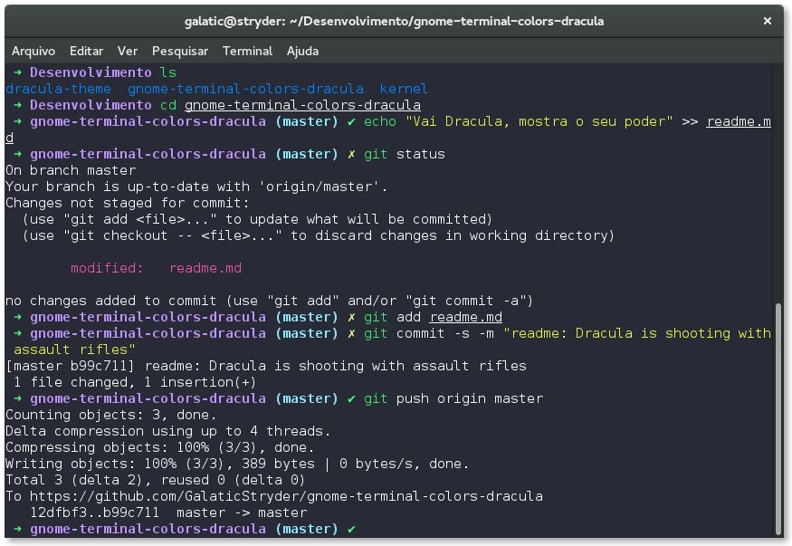

# Dracula for [Gnome Terminal](https://wiki.gnome.org/Apps/Terminal)

> A dark theme for [Gnome Terminal](https://wiki.gnome.org/Apps/Terminal).

## Install

All instructions can be found at [draculatheme.com/gnome-terminal](https://draculatheme.com/gnome-terminal).

## Credits

This colorscheme is based on the well-known _Solarized Dark_ colorscheme for the Gnome Terminal.

## Community

- [Twitter](https://twitter.com/draculatheme) - Best for getting updates about themes and new stuff.
- [GitHub](https://github.com/dracula/dracula-theme/discussions) - Best for asking questions and discussing issues.
- [Discord](https://draculatheme.com/discord-invite) - Best for hanging out with the community.

## Dracula PRO

## License

[MIT License](./LICENSE)
